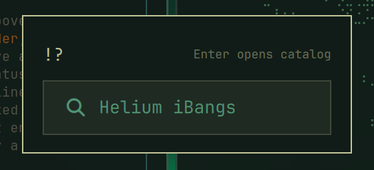
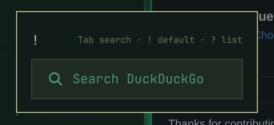
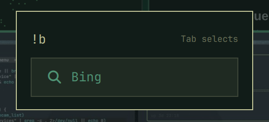
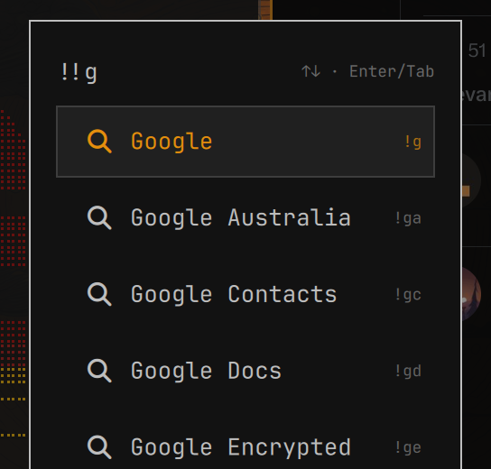
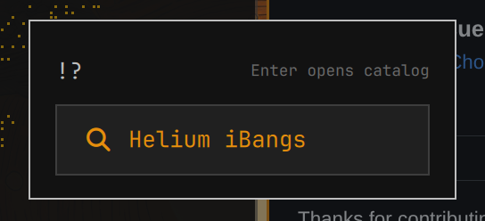

# Omibang

Omarchy's command menu with fast, menu-only [Helium iBang](https://helium.computer/bangs) search.

Omibang replaces the built-in `omarchy.menu` plugin without changing its normal menus, application search, routes, or keybindings. It adds direct iBang searches, a configurable default engine, and a link to Helium's complete catalog.



## Screenshots

| DuckDuckGo default | Direct iBang |
| --- | --- |
|  |  |
| **Choose a default** | **Open Helium's catalog** |
|  |  |

## Requirements

- Omarchy with the Quickshell-based shell
- Python 3; only the standard library is used
- Network access to refresh Helium's public iBang registry

## Install

```sh
omarchy plugin add https://github.com/Hutsoncap/omibang.git --enable
```

Omibang declares `clonedFrom: omarchy.menu`, so existing menu keybindings, bar actions, dmenu callers, and `omarchy menu` commands are routed to it automatically. Disable or remove another custom `omarchy.menu` clone before enabling Omibang.

## Search

Open the menu normally, then:

| Input | Action |
| --- | --- |
| `!` | Show the default search engine |
| `!` then `Tab` | Select the default engine and type a query |
| `!y` | List matching iBangs with an exact trigger first |
| `!yt cats` | Search YouTube directly |
| `!!ddg` then `Enter` | Make DuckDuckGo the default engine |
| `!!y` | List matching iBangs to choose a new default |
| `!?` then `Enter` | Open Helium's complete iBang catalog |

Use `Up` and `Down` to highlight a match. Press `Enter` or `Tab`: `!` searches commit the trigger and add a space so you can type the query immediately, while `!!` defaults save the highlighted engine.

DuckDuckGo (`!ddg`) is the default on a fresh installation. Any exact trigger in Helium's catalog can replace it.

## Data and configuration

Omibang downloads Helium's registry from `https://services.helium.imput.net/bangs.json` on the first iBang lookup. The compact registry is cached at:

```text
~/.cache/omarchy-search/bangs.json
```

The cache refreshes lazily after 24 hours. If refresh fails, the stale cache remains available.

Choosing a default with `!!<trigger>` explicitly writes:

```text
~/.config/omarchy/extensions/omarchy-search.json
```

The prior configuration is retained as `omarchy-search.json.bak`. Omibang does not overwrite other user configuration.

## Update

```sh
omarchy plugin update io.github.hutsoncap.omibang
```

## Remove

```sh
omarchy plugin remove io.github.hutsoncap.omibang --yes
```

Removing Omibang restores the built-in Omarchy menu.

## Development

```sh
omarchy plugin validate .
/usr/lib/qt6/bin/qmllint -I "$OMARCHY_PATH/shell" BarWidget.qml Menu.qml
python3 -m unittest discover -s tests -v
```

## Attribution

Omibang is based on Omarchy's MIT-licensed `omarchy.menu` plugin. Helium provides the public iBang registry; Omibang is not affiliated with or endorsed by Helium.

## License

[MIT](LICENSE)
